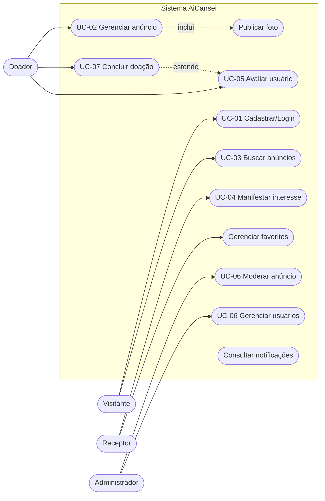
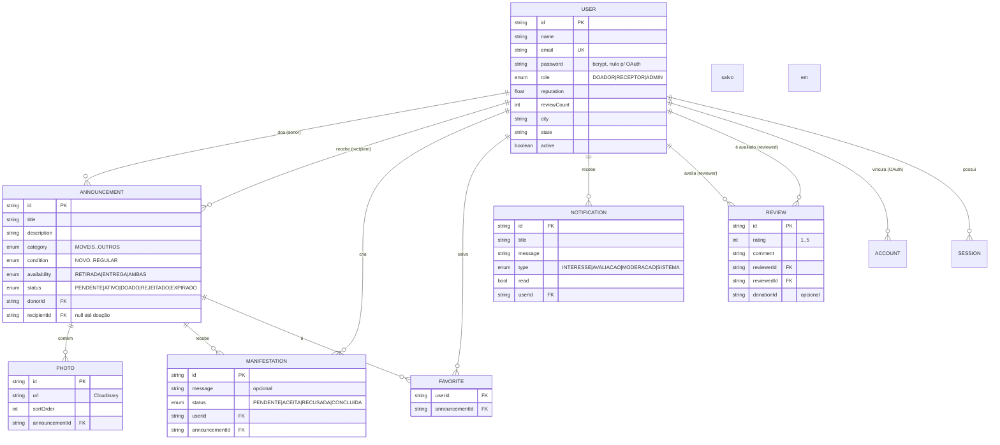
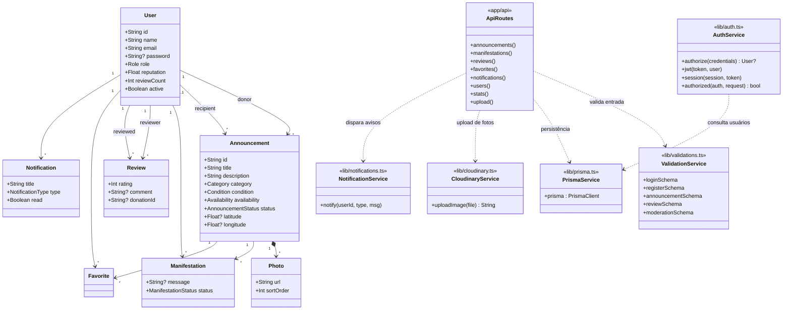
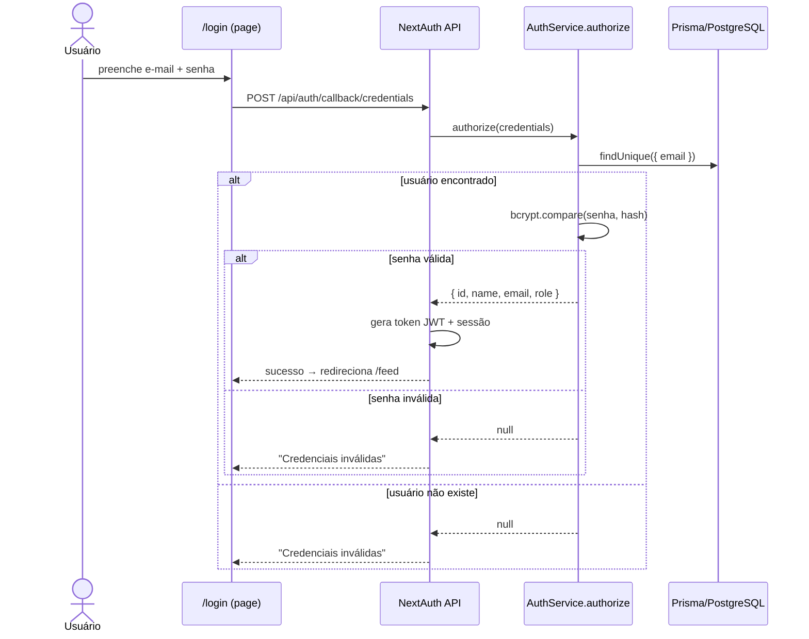
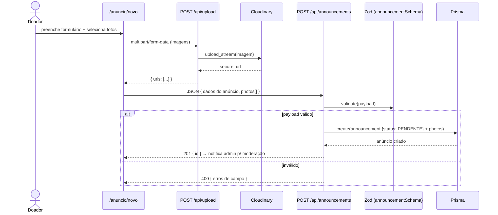
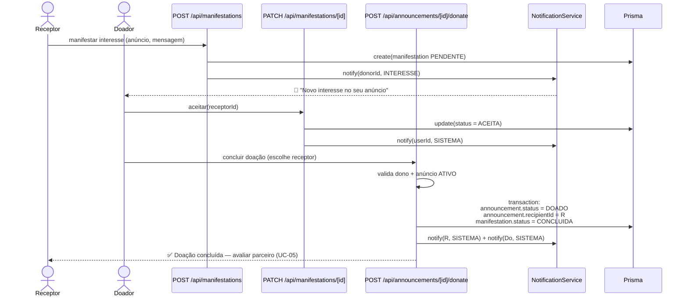
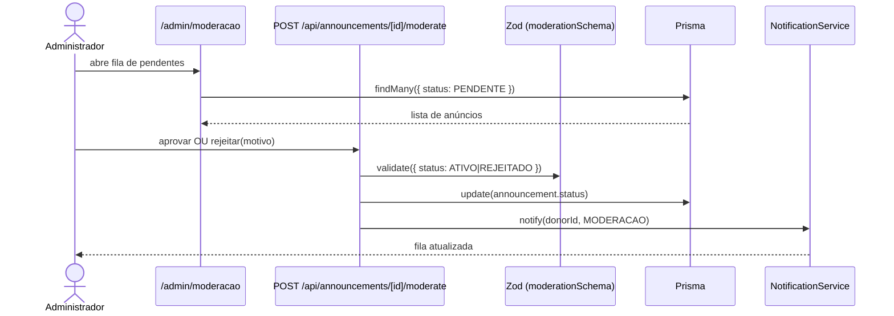

# 🌱 AiCansei — Documentação do Projeto

> Plataforma web de doação de itens usados: doe o que não usa mais e encontre coisas incríveis.

---

## 1. Título do Projeto

**AiCansei** — *"Ai, cansei desse item"*: em vez de jogar fora, doe.

Plataforma que conecta pessoas que possuem itens em bom estado, mas sem uso, a pessoas interessadas em recebê-los por doação — promovendo solidariedade, redução de desperdício e sustentabilidade.

---

## 2. Interessados (Stakeholders)

| Stakeholder | Papel | Interesse no projeto |
|---|---|---|
| **Doador** | Usuário que publica anúncios de itens | Descartar itens com responsabilidade, ajudar pessoas, obter reputação positiva |
| **Receptor** | Usuário que manifesta interesse em itens | Conseguir itens gratuitamente de forma confiável |
| **Administrador (Admin)** | Moderador da plataforma | Garantir qualidade e segurança dos anúncios, gerenciar usuários |
| **Equipe de desenvolvimento** | Mantém a plataforma | Código testado, escalável e de fácil manutenção |
| **Comunidade local** | Beneficiária indireta | Redução de desperdício, fortalecimento de vínculos entre vizinhos |
| **Meio ambiente** | Beneficiário indireto | Menos resíduos em aterros, consumo consciente |

---

## 3. Objetivos Funcionais

- **OF-01 — Cadastro e autenticação:** permitir cadastro com e-mail/senha e login seguro (NextAuth v5, sessão JWT); papéis DOADOR, RECEPTOR e ADMIN.
- **OF-02 — Gestão de anúncios:** criar, editar e excluir anúncios com título, descrição, categoria, condição, disponibilidade (retirada/entrega), localização e fotos.
- **OF-03 — Busca e filtros:** buscar anúncios por texto e filtrar por categoria, condição e cidade.
- **OF-04 — Manifestação de interesse:** receptor envia mensagem de interesse; doador aceita ou recusa.
- **OF-05 — Fluxo completo de doação:** doador escolhe um interessado, concretiza a doação e o anúncio é marcado como DOADO.
- **OF-06 — Avaliações:** usuários se avaliam (1–5 estrelas + comentário) após doações; reputação média é calculada.
- **OF-07 — Moderação:** anúncios novos ficam PENDENTES até aprovação/rejeição pelo admin.
- **OF-08 — Painel administrativo:** estatísticas gerais, fila de moderação e gestão de usuários.
- **OF-09 — Favoritos:** salvar anúncios para consulta posterior.
- **OF-10 — Notificações:** avisos de interesse, moderação e sistema, com marcação como lidas.

---

## 4. Objetivos Não-Funcionais

| ID | Categoria | Objetivo |
|---|---|---|
| ONF-01 | Segurança | Senhas com hash **bcrypt**; sessões JWT; proteção de rotas via middleware `authorized`; validação de entrada com **Zod**; controle de acesso por papel (RBAC) |
| ONF-02 | Usabilidade | Interface responsiva (Tailwind CSS v4), feedback com toasts, navegação simples em 3 passos (Anuncie → Conecte-se → Doe) |
| ONF-03 | Performance | Renderização otimizada com Next.js 16 (App Router + Turbopack), índices no PostgreSQL para consultas frequentes |
| ONF-04 | Escalabilidade/Disponibilidade | Deploy serverless na Vercel; banco gerenciado (Supabase); imagens em CDN (Cloudinary) |
| ONF-05 | Confiabilidade/Testabilidade | Suíte com ~290 testes unitários e de integração (Jest/Vitest) |
| ONF-06 | Manutenibilidade | TypeScript estrito, estrutura modular (`app`, `components`, `lib`), ORM Prisma com schema versionado |
| ONF-07 | Portabilidade | Acesso via navegador desktop/mobile, sem instalação |
| ONF-08 | Privacidade | Dados pessoais expostos apenas ao próprio usuário e admins; termos de uso publicados |

---

## 5. Diagrama de Casos de Uso



---

## 6. Descrição Detalhada dos Casos de Uso Principais

### UC-01 — Cadastrar e Autenticar

| Campo | Descrição |
|---|---|
| **Ator principal** | Visitante / Usuário |
| **Pré-condições** | E-mail válido não cadastrado (para registro) |
| **Fluxo principal** | 1. Usuário acessa `/cadastro`. 2. Informa nome, e-mail e senha (mín. 6 caracteres). 3. Sistema valida dados (Zod) e cria conta com senha criptografada (bcrypt). 4. Usuário faz login em `/login` e recebe sessão JWT. |
| **Fluxos alternativos** | A1: Login via provedor externo (OAuth Google) — conta vinculada automaticamente. |
| **Fluxos de exceção** | E1: E-mail já cadastrado → mensagem de erro. E2: Senha incorreta → credenciais inválidas. E3: Dados inválidos → erros inline nos campos. |

### UC-02 — Gerenciar Anúncios

| Campo | Descrição |
|---|---|
| **Ator principal** | Doador |
| **Pré-condições** | Autenticado como DOADOR |
| **Fluxo principal** | 1. Doador acessa `/anuncio/novo`. 2. Preenche título, descrição, categoria, condição, disponibilidade e localização. 3. Envia fotos (upload → Cloudinary). 4. Sistema valida (announcementSchema) e cria anúncio com status **PENDENTE**. 5. Após moderação, status passa a **ATIVO**. |
| **Fluxos alternativos** | A1: Editar anúncio próprio em `/anuncio/[id]/editar`. A2: Excluir anúncio em `/meus-anuncios`. |
| **Fluxos de exceção** | E1: Título < 5 caracteres ou descrição < 10 → validação rejeita. E2: Falha no upload de imagem → erro reportado, anúncio não publicado. |

### UC-03 — Buscar Anúncios

| Campo | Descrição |
|---|---|
| **Ator principal** | Qualquer usuário (público) |
| **Pré-condições** | Existirem anúncios ATIVOS |
| **Fluxo principal** | 1. Usuário acessa `/feed`. 2. Sistema lista anúncios ativos paginados. 3. Usuário digita termo na busca e/ou aplica filtros (categoria, condição, cidade). 4. Sistema retorna resultados filtrados. |
| **Fluxos alternativos** | A1: Abrir detalhe do anúncio em `/anuncio/[id]`, favoritar ou manifestar interesse. |
| **Fluxos de exceção** | E1: Nenhum resultado → estado vazio orientando nova busca. |

### UC-04 — Manifestar Interesse

| Campo | Descrição |
|---|---|
| **Ator principal** | Receptor |
| **Pré-condições** | Autenticado; anúncio em status ATIVO; não ser o próprio doador |
| **Fluxo principal** | 1. Receptor abre o anúncio. 2. Escreve mensagem opcional (máx. 500 caracteres). 3. Sistema registra manifestação **PENDENTE** e notifica o doador. 4. Uma manifestação por usuário/anúncio (restrição de unicidade). |
| **Fluxos alternativos** | A1: Doador **aceita** → status ACEITA; A2: Doador **recusa** → status RECUSADA. |
| **Fluxos de exceção** | E1: Anúncio não está ATIVO → operação bloqueada. E2: Interesse duplicado → erro de unicidade. |

### UC-05 — Avaliar Usuário

| Campo | Descrição |
|---|---|
| **Ator principal** | Doador ou Receptor |
| **Pré-condições** | Autenticado; interação concluída com o outro usuário |
| **Fluxo principal** | 1. Usuário acessa perfil do parceiro. 2. Seleciona nota de 1 a 5 estrelas e comentário opcional. 3. Sistema registra avaliação e recalcula `reputation`/`reviewCount` do avaliado. |
| **Fluxos alternativos** | A1: Avaliação vinculada a uma doação específica (`donationId`). |
| **Fluxos de exceção** | E1: Nota fora do intervalo 1–5 → validação rejeita. E2: Avaliação duplicada para mesma doação → bloqueada (chave única). |

### UC-06 — Moderar e Administrar

| Campo | Descrição |
|---|---|
| **Ator principal** | Administrador |
| **Pré-condições** | Autenticado com role ADMIN; acesso restrito a `/admin/*` |
| **Fluxo principal** | 1. Admin abre `/admin` e visualiza estatísticas. 2. Em `/admin/moderacao`, revisa anúncios PENDENTES na fila. 3. **Aprova** (→ ATIVO) ou **rejeita** com motivo (→ REJEITADO); doador é notificado. |
| **Fluxos alternativos** | A1: Em `/admin/usuarios`, listar, editar papel e desativar usuários. |
| **Fluxos de exceção** | E1: Não-admin tenta acessar → redirecionamento/negado. E2: Status informado inválido → validação rejeita. |

### UC-07 — Concluir Doação

| Campo | Descrição |
|---|---|
| **Ator principal** | Doador |
| **Pré-condições** | Anúncio ATIVO com ao menos uma manifestação ACEITA |
| **Fluxo principal** | 1. Doador escolhe o receptor na lista de interessados. 2. Confirma a doação (`POST /api/announcements/[id]/donate`). 3. Sistema define `recipientId`, status do anúncio → **DOADO**, manifestação → CONCLUIDA. 4. Partes são notificadas; ambas podem avaliar (extende UC-05). |
| **Fluxos alternativos** | A1: Combinar retirada ou entrega conforme disponibilidade do anúncio. |
| **Fluxos de exceção** | E1: Apenas o dono pode doar → 403. E2: Anúncio já DOADO → conflito. |

---

## 7. Protótipos de Tela

Wireframes das telas principais (implementadas no app):

### Home (`/`)
```
┌──────────────────────────────────────────────────┐
│  🌱 AiCansei          [Feed] [Sobre] [Entrar]     │
├──────────────────────────────────────────────────┤
│                                                  │
│         Doe o que não usa mais.                  │
│    Encontre coisas incríveis. Conecte pessoas.   │
│                                                  │
│      [ Comece agora ]   [ Saiba mais ]           │
│                                                  │
│  ┌─────────┐  ┌─────────┐  ┌─────────┐           │
│  │ 📦      │  │ 👥      │  │ ❤️      │           │
│  │Anuncie  │  │Conecte- │  │ Doe     │           │
│  │em segs. │  │se       │  │         │           │
│  └─────────┘  └─────────┘  └─────────┘           │
└──────────────────────────────────────────────────┘
```

### Feed (`/feed`)
```
┌──────────────────────────────────────────────────┐
│ 🌱 AiCansei   [🔍 buscar...] [Categoria ▾]       │
│               [Condição ▾] [Cidade ▾]            │
├──────────────────────────────────────────────────┤
│ ┌────────────┐ ┌────────────┐ ┌────────────┐      │
│ │ [foto]     │ │ [foto]     │ │ [foto]     │      │
│ │ Sofá 3 lug.│ │ Bicicleta  │ │ Kit livros │      │
│ │ Móveis·Ótimo│ │Esportes·Bom│ │Livros·Novo │      │
│ │ SP · ❤ ♡   │ │ SP · ❤ ♡   │ │ Camp · ❤ ♡ │      │
│ └────────────┘ └────────────┘ └────────────┘      │
│              [ Carregar mais ]                   │
└──────────────────────────────────────────────────┘
```

### Novo Anúncio (`/anuncio/novo`)
```
┌──────────────────────────────────────────────────┐
│  Publicar doação                                 │
├──────────────────────────────────────────────────┤
│  Título*      [____________________]             │
│  Descrição*   [____________________]             │
│               [____________________]             │
│  Categoria*   [Móveis ▾]   Condição*[Ótimo ▾]    │
│  Disponib.*   ( )Retirada (•)Entrega ( )Ambas    │
│  Fotos        [+ Enviar imagens]                 │
│               [thumb][thumb][+]                  │
│             [ Publicar ]                         │
└──────────────────────────────────────────────────┘
```

### Detalhe do Anúncio (`/anuncio/[id]`)
```
┌──────────────────────────────────────────────────┐
│ ← Voltar                        ♡ Favoritar      │
│ ┌────────────────────────────┐                   │
│ │      [foto principal]      │ ‹ ›               │
│ └────────────────────────────┘                   │
│  Sofá 3 lugares                                  │
│  Badge: MÓVEIS · ÓTIMO · ATIVO                   │
│  "Sofá pouco usado, entrega em São Paulo..."     │
│  Por Maria S. ⭐4.8 (12) · São Paulo/SP          │
│ ┌──────────────────────────────────────────────┐ │
│ │ Tenho interesse!                             │ │
│ │ Mensagem [__________________]  [Enviar]      │ │
│ └──────────────────────────────────────────────┘ │
└──────────────────────────────────────────────────┘
```

### Moderação Admin (`/admin/moderacao`)
```
┌──────────────────────────────────────────────────┐
│ Admin │ Dashboard │ Moderação │ Usuários         │
├──────────────────────────────────────────────────┤
│ Fila de moderação (2 pendentes)                  │
│ ┌──────────────────────────────────────────────┐ │
│ │ [foto] Bicicleta aro 26 · joao@email.com     │ │
│ │ [ ✓ Aprovar ]  [ ✗ Rejeitar ]                │ │
│ ├──────────────────────────────────────────────┤ │
│ │ [foto] TV antiga · ana@email.com             │ │
│ │ [ ✓ Aprovar ]  [ ✗ Rejeitar ]                │ │
│ └──────────────────────────────────────────────┘ │
└──────────────────────────────────────────────────┘
```

---

## 8. Modelo de Domínio



Estados principais:
- **Anúncio:** `PENDENTE → ATIVO → DOADO`; ramificações: `REJEITADO`, `EXPIRADO`
- **Manifestação:** `PENDENTE → ACEITA|RECUSADA → CONCLUIDA`

---

## 9. Diagrama de Classes do Projeto



---

## 10. Diagramas de Sequência do Projeto

### 10.1 Login com credenciais



### 10.2 Criar anúncio com upload de fotos



### 10.3 Fluxo completo de doação (interesse → aceite → doação)



### 10.4 Moderação de anúncio



---

*Documento gerado a partir do código-fonte em `~/aicansai` (schema Prisma, rotas de API, páginas e bibliotecas auxiliares). Diagramas em Mermaid — renderizáveis no GitHub, VS Code e mermaid.live.*
