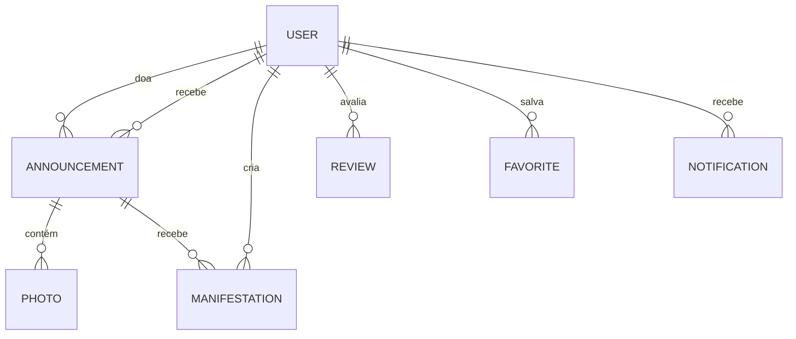

# Etapa 2 — Elaboração

**Projeto:** AiCansei
**Fase do RUP:** Elaboração
**Foco:** Arquitetura, modelo de domínio e fundação técnica

## 1. Objetivo da Etapa

Definir e implementar a espinha dorsal do sistema: arquitetura, modelagem de domínio, configuração do ambiente de desenvolvimento e bibliotecas utilitárias compartilhadas.

## 2. Decisões de Arquitetura

| Decisão | Escolha | Justificativa |
|---|---|---|
| Framework full-stack | **Next.js 16** (App Router, Turbopack) | SSR/SSG + API Routes num só projeto; deploy simples |
| Estilização | **Tailwind CSS v4** | Produtividade e consistência visual |
| Banco de dados | **PostgreSQL (Supabase)** | Relacional se encaixa no domínio; free tier gerenciado |
| ORM | **Prisma** | Schema versionado, type-safety, migrations |
| Autenticação | **NextAuth v5** (Credentials + Google) | Sessão JWT madura, OAuth pronto |
| Armazenamento de imagens | **Cloudinary** | CDN, transformações on-the-fly, free tier |
| Validação | **Zod** | Schemas reutilizáveis client/server |
| Deploy | **Vercel** | CI/CD automático para Next.js |

Arquitetura em camadas: **Páginas/Componentes → API Routes → Serviços (lib) → Prisma → PostgreSQL.**

## 3. Modelo de Domínio

Entidades centrais: `User`, `Announcement`, `Photo`, `Manifestation`, `Review`, `Favorite`, `Notification`.

Regras de negócio principais definidas nesta fase:

- Papéis: `DOADOR`, `RECEPTOR`, `ADMIN` (usuário pode atuar como doador e receptor)
- Ciclo de vida do anúncio: `PENDENTE → ATIVO → DOADO` (+ `REJEITADO`, `EXPIRADO`)
- Ciclo da manifestação: `PENDENTE → ACEITA/RECUSADA → CONCLUIDA`
- Uma manifestação por usuário por anúncio (unicidade)
- Reputação = média das notas recebidas (1–5)

Schema completo: [`prisma/schema.prisma`](../prisma/schema.prisma)

## 4. Fundação Técnica Implementada

- ⚙️ Configurações: `tsconfig.json`, `next.config.ts`, `eslint.config.mjs`, `postcss.config.mjs`
- 📦 Dependências e lockfile (`package.json`, `package-lock.json`)
- 🗄️ Schema Prisma com índices para consultas frequentes (categoria, status, cidade, createdAt)
- 🧩 Bibliotecas compartilhadas:
  - `src/lib/prisma.ts` — cliente Prisma singleton
  - `src/lib/constants.ts` — categorias, condições e enums de interface
  - `src/lib/utils.ts` — formatação, helpers de data/moeda/texto
  - `src/lib/validations.ts` — schemas Zod de todas as entradas
- 🔐 Variáveis de ambiente documentadas em `.env.example`

## 5. Plano das Iterações de Construção

| Iteração | Escopo |
|---|---|
| Construção I | CU-01 autenticação + design system base |
| Construção II | CU-02/03 anúncios, busca e upload |
| Continuação II | CU-04/05/06/07 interações, admin e testes |

## Artefatos Produzidos Nesta Etapa

- ✅ Modelo de domínio (schema Prisma versionado)
- ✅ Documento de arquitetura (este documento)
- ✅ Ambiente configurado e reproduzível
- ✅ Bibliotecas utilitárias testáveis

➡️ **Próxima etapa:** [Construção — Iteração 1](./etapa-3-construcao-iteracao-1.md)
